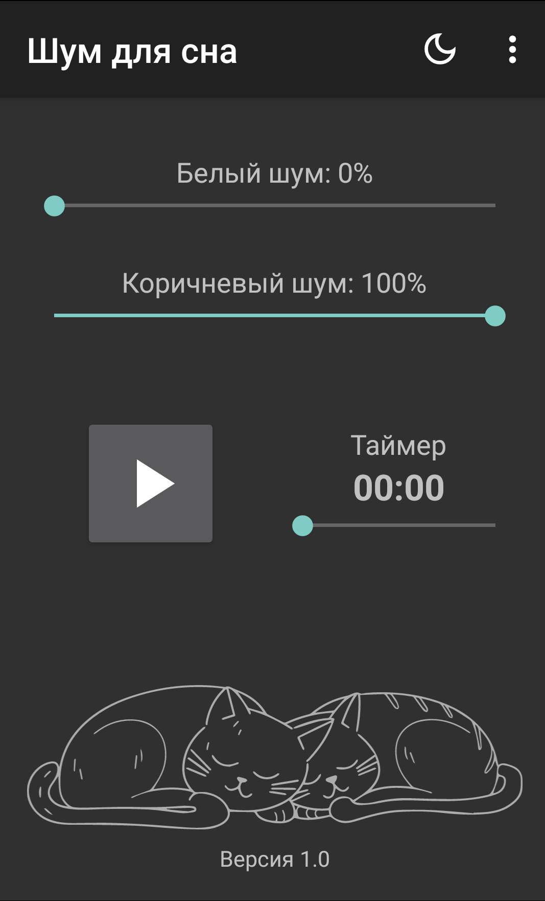
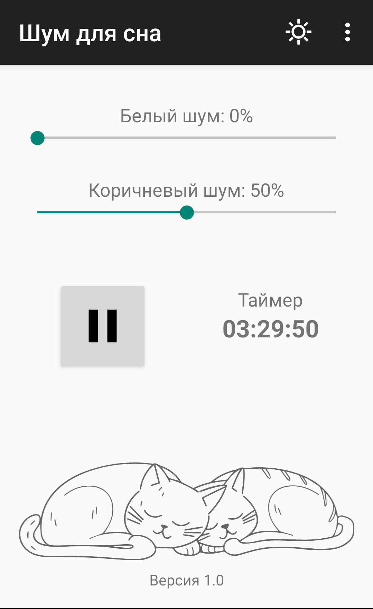

# Sleep Noise

[](https://github.com/pravbeseda/sleep-noise/actions/workflows/ci.yml)

Android app that **synthesizes** white and brown noise in real time to help you fall asleep,
with a countdown timer that stops playback on its own.

Nothing is streamed and nothing is bundled: the samples are generated on the device, so the app
has no audio assets, needs no network access, and never runs out of loop to repeat.

<a href="https://play.google.com/store/apps/details?id=ru.pravbeseda.sleepnoise">Get it on Google Play</a>

| Dark theme, idle | Light theme, playing |
|---|---|
|  |  |

## Features

- **Two independent noise channels** — white and brown, each with its own switch and volume slider.
  Switch one off to hear only the other; its level is kept for the next time you switch it back on.
- **Sleep timer** — up to several hours in 30-minute steps; playback stops when it runs out.
- **Plays through the night** — the noise and the timer live in a foreground service, so leaving
  the app, locking the screen or switching theme does not stop them. The ongoing notification
  counts the timer down and carries a Stop action.
- **Gets out of the way** — an incoming call silences the noise and it comes back afterwards;
  unplugging the headphones stops it instead of moving it to the speaker.
- **Three themes** — system, light, dark (dark by default).
- **Six languages** — English, Arabic, German, Spanish, Russian, Ukrainian, with full RTL support.
- **No ads, no accounts, no audio files.**

Volumes, theme, language, and the last timer value are remembered between launches.

## Known limitations

Being honest about the current state. The roadmap lives in
[`docs/plans/REFACTORING_PLAN.md`](docs/plans/REFACTORING_PLAN.md), and the two below were decided
in [`docs/plans/PHASE_3_PLAYBACK_SERVICE.md`](docs/plans/PHASE_3_PLAYBACK_SERVICE.md):

- The playback service has no automated tests yet: CI runs the project's instrumented tests on an
  emulator, but none of them covers the service, so its lifecycle, notification and audio-focus
  handling are verified by hand on a device.
- No lock-screen or headset-button controls — the ongoing notification's Stop action is the only
  control outside the app.

## Building from source

Requires JDK 17 and the Android SDK (compileSdk 36, minSdk 26).

```bash
git clone git@github.com:pravbeseda/sleep-noise.git
cd sleep-noise
./gradlew assembleDebug
```

**`app/google-services.json` is required and is not in the repository.** The
`com.google.gms.google-services` and Crashlytics plugins are applied unconditionally, so the build
fails without it — including unit tests, which never touch Firebase at runtime. Download it from
the Firebase console (project settings → your app) into `app/`.

It stays out of git deliberately: this repository is public, and a committed key is picked up by
secret scanners within hours and stuck in the history for good.

### Common commands

```bash
./gradlew assembleDebug          # debug APK
./gradlew installDebug           # build + install on a connected device
./gradlew testDebugUnitTest      # JVM unit tests
./gradlew koverVerifyDebug       # unit tests + the coverage floor
./gradlew koverLogDebug          # print the coverage figure without enforcing it
./gradlew connectedAndroidTest   # instrumented tests (needs a device or emulator)
./gradlew lint                   # Android lint — fails on new warnings
./gradlew detekt                 # Kotlin static analysis (baselined)
./gradlew spotlessCheck          # ktlint formatting, changed files only
./gradlew spotlessApply          # fix what spotlessCheck reports
./gradlew assembleRelease        # signed release APK (needs the maintainer's keystore)
```

Formatting rules live in `.editorconfig` (ktlint's `intellij_idea` style, 140-column lines), so
Android Studio and the CI check agree without configuring the IDE. Spotless formats only what your
branch changed relative to `origin/main`, so the existing code is left alone. That ratchet needs the `origin/main` ref: in a shallow or single-branch clone every
spotless task fails instead of silently checking nothing.

## Project layout

```
app/src/main/java/ru/pravbeseda/sleepnoise/
├── MainActivity.kt          # UI wiring, theme and language selection, playback control
├── CreditsDialogFragment.kt
├── media/                   # NoiseEngine + NoiseMixer + White/Brown noise sources
├── playback/                # PlaybackService (foreground) + AudioFocus
├── timer/                   # TimerView, SleepTimer, TimerPreferences
├── ui/                      # NoiseControlView — one noise's switch, label and slider
├── models/ · adapters/
```

The UI is XML layouts with AppCompat Views throughout. The Compose dependencies present in the
build are unused leftovers, scheduled for removal — do not treat them as the intended direction.

Architecture notes, including the parts that are non-obvious (how the active locale is detected,
why the theme is applied before `super.onCreate`, how versioning works), live in
[`CLAUDE.md`](CLAUDE.md).

## Contributing

`main` is protected — no direct commits or pushes. Branch from an up-to-date `main` and open a PR:

```bash
git fetch origin && git checkout -b <type>/<slug> origin/main
```

After a fresh clone, run these once — they live in `.git/config`, which is never cloned:

```bash
git config core.hooksPath .githooks    # activate the versioned hooks
git config remote.origin.prune true    # drop stale remote-tracking refs on fetch
```

The hooks refuse commits and pushes on `main` and `release`; GitHub enforces the same rule
server-side. Delete your branch once its PR is merged, and never reuse it — `versionCode` is
derived from the commit count, so `main` has to stay append-only.

### Tests

Unit tests, lint, detekt, formatting, Guardrails and the instrumented tests are required checks: a
red run blocks the merge, and the branch has to be current with `main` before it can go in. The
first four run locally; Guardrails compares the PR against its base commit, so it exists only on CI,
and the instrumented tests run on emulators at API 26 and API 36 — one required context per level. A
pull request that changes only Markdown skips the five Gradle jobs — they still report green, they
just do no work.
Before opening a PR:

```bash
./gradlew spotlessCheck detekt testDebugUnitTest koverVerifyDebug lint
```

New pure logic — anything that does not import `android.*` — is written test-first and lands with
its test in the same commit. `AndroidFreeSourcesTest` checks that boundary, `androidx.*` included,
for two roots only: `media/` minus `NoiseEngine.kt`, plus `timer/SleepTimer.kt`. Anywhere else the
rule is discipline. Android plumbing is exempt from test-first, but a PR that leaves behaviour
uncovered says which behaviour and why. Bug fixes start with a test that reproduces the bug. No test
gets disabled or weakened to turn a build green. `koverVerifyDebug` puts a line-coverage floor under
the noise and timer logic; `CLAUDE.md` says what it is and which classes it counts.

The full rule, and the reasoning for drawing the line there, is in [`CLAUDE.md`](CLAUDE.md).

### Adding a language

Translations are the most welcome contribution — the app even asks users for them.

1. Create `app/src/main/res/values-XX/strings.xml`, including
   `<string name="lang">XX</string>` (the code reads this back to detect the active locale).
2. Add a flag drawable.
3. Add a `Language(...)` entry to the array in `MainActivity.languageSelection()`.

## Versioning and releasing

`versionName` lives in `app/version.properties` and is the only value bumped by hand.
`versionCode` is derived from `git rev-list --count HEAD` and must never be edited — a release
build whose version cannot be derived from the repository is rejected outright by the
`verifyReleaseVersioning` Gradle task. Any CI job that builds a release must check out with
`fetch-depth: 0`.

Release commits follow the form `Release 1.0.3 (5)`.

Every merge into `main` also builds a signed release APK and sends it to the alpha testers through
Firebase App Distribution. That build needs the maintainer's upload keystore, which is not in the
repository, so it runs on CI only — a contribution never has to sign anything.

## Credits

- Development — Alexander Ivanov
- Logo — Nina Ivanova

[Terms & Conditions](sleep-noise-policy.html) · contact: kalugaman@gmail.com

## License

No license file — all rights reserved. The source is published for transparency and for
translation contributions, not for redistribution or derivative apps.
